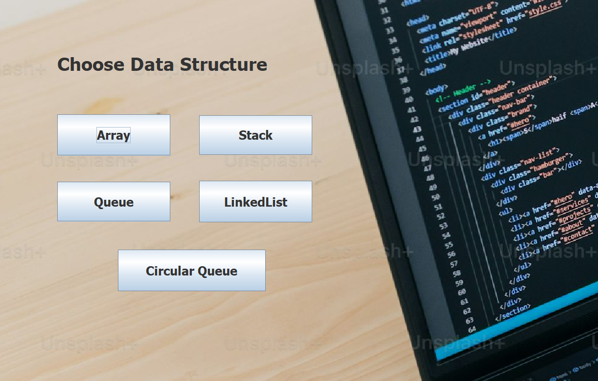

# Java Data Structures Implementations

This repository contains Java implementations of fundamental data structures. Each data structure is implemented in a dedicated Java class with methods to perform standard operations. This project serves as a practical guide for understanding and using data structures in Java.

## Homepage Screenshot



## Data Structures Included

### Array (`array.java`)

The `Array` class provides basic operations for fixed-size arrays, such as:

- Adding elements
- Accessing elements by index
- Displaying the contents

### Stack (`stack.java`)

The `Stack` class implements a Last-In-First-Out (LIFO) structure. Supported operations include:

- **push**: Adds an element to the top of the stack.
- **pop**: Removes the top element.
- **peek**: Returns the top element without removing it.

### Queue (`queue.java`)

The `Queue` class implements a First-In-First-Out (FIFO) structure with the following operations:

- **enqueue**: Adds an element to the back of the queue.
- **dequeue**: Removes the front element.
- **peek**: Returns the front element without removing it.

### Circular Queue (`cqueue.java`)

The `Circular Queue` class improves on the standard queue by reusing empty spaces. Operations include:

- **enqueue**: Adds an element at the end, wrapping around if necessary.
- **dequeue**: Removes an element from the front.
- **peek**: Checks the element at the front without removing it.

### Linked List (`linkedlist.java`)

The `LinkedList` class provides a dynamic list that allows elements to be easily added or removed. Operations include:

- **add**: Inserts an element at the end.
- **remove**: Deletes an element by value.
- **display**: Shows all elements in the list.

## Project Structure

- `src/dsImpl/`: Contains Java source files for each data structure.
- `bin/`: Compiled `.class` files.
- `img/`: Contains images for documentation or illustration purposes.

## How to Run

### Prerequisites

1. **Java Development Kit (JDK)**: Ensure you have JDK installed to compile and run the code.
2. **Eclipse IDE**: Download and install [Eclipse IDE](https://www.eclipse.org/downloads/).
3. **WindowBuilder Plugin**: This project uses WindowBuilder, a GUI designer for Java Swing. If not already installed, follow these steps:
   - Go to `Help` > `Eclipse Marketplace`.
   - Search for "WindowBuilder" and install it.
   - Restart Eclipse after installation.

### Running the Project in Eclipse

1. **Clone the Repository**:
   ```bash
   git clone https://github.com/manjunathdp/Data-Structures-Implementations-Java.git
   ```
2. Import Project into Eclipse

   1. Open Eclipse and go to **File > Import**.
   2. Select **General > Existing Projects into Workspace**, then click **Next**.
   3. Browse to the cloned project folder, select it, and click **Finish**.

3. Build and Run the Project

   1. Right-click on the project in the **Package Explorer** and select **Build Project**.
   2. Open the class file you want to run (e.g., `Stack.java`), right-click, and select **Run As > Java Application**.

# Running the Project from Command Line

If you prefer to run the project from the command line, follow these steps:

### Navigate to the Project Directory:

```bash
cd Data-Structures-Implementations-Java
```

### Compile the Java Files:

```bash
javac src/dsImpl/*.java
```

### Run a Specific Class:

```bash
java src.dsImpl.Stack  # Replace 'Stack' with the desired class name
```
